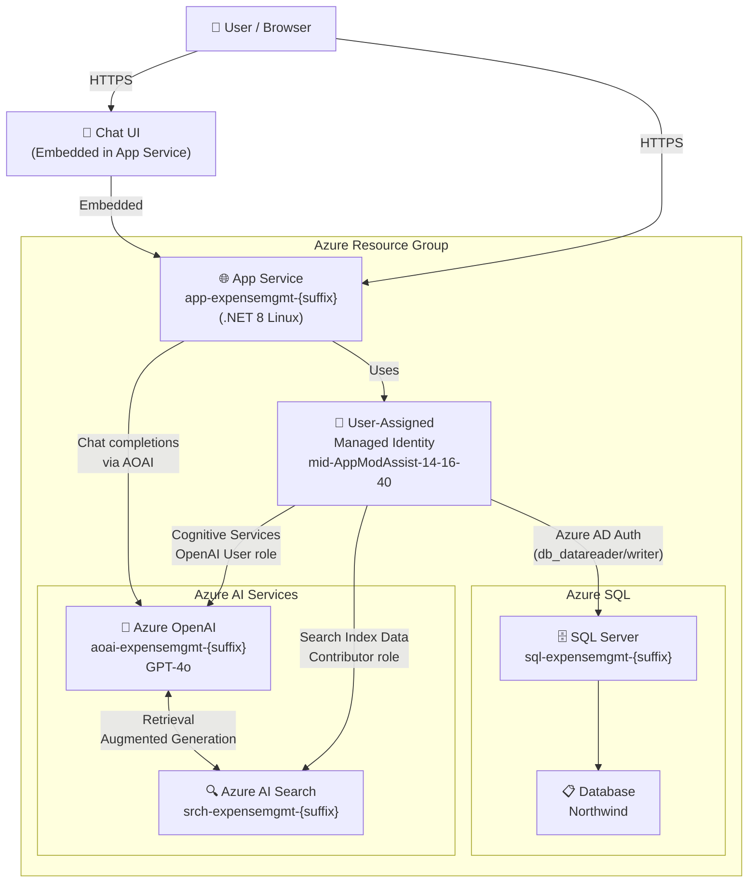

# Expense Management System – Azure Architecture Diagram

```mermaid
graph TD
    User["👤 User / Browser"]
    ChatUI["💬 Chat UI\n(Embedded in App Service)"]

    subgraph RG["Azure Resource Group"]
        MI["🪪 User-Assigned\nManaged Identity\nmid-AppModAssist-14-16-40"]

        AppSvc["🌐 App Service\napp-expensemgmt-{suffix}\n(.NET 8 Linux)"]

        subgraph SQL["Azure SQL"]
            SQLSrv["🗄️ SQL Server\nsql-expensemgmt-{suffix}"]
            DB["📋 Database\nNorthwind"]
        end

        subgraph GenAI["Azure AI Services"]
            AOAI["🤖 Azure OpenAI\naoai-expensemgmt-{suffix}\nGPT-4o"]
            Search["🔍 Azure AI Search\nsrch-expensemgmt-{suffix}"]
        end
    end

    User -->|"HTTPS"| AppSvc
    User -->|"HTTPS"| ChatUI
    ChatUI -->|"Embedded"| AppSvc

    AppSvc -->|"Uses"| MI
    MI -->|"Azure AD Auth\n(db_datareader/writer)"| SQLSrv
    SQLSrv --> DB

    MI -->|"Cognitive Services\nOpenAI User role"| AOAI
    MI -->|"Search Index Data\nContributor role"| Search

    AOAI <-->|"Retrieval\nAugmented Generation"| Search
    AppSvc -->|"Chat completions\nvia AOAI"| AOAI
```
